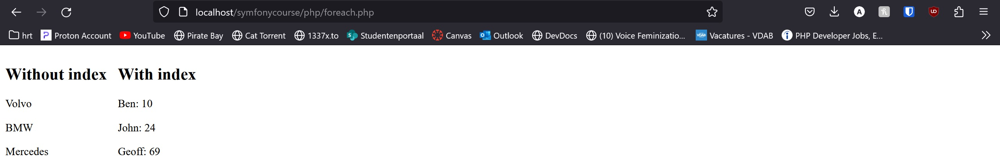

# Arrays

## Indexed arrays

Indexed arrays are arrays with a numeric index  
An indexed array can be assigned automatically (index always starts at 0)

```php
$cars = ["Volvo", "BMW", "Mercedes"];
```

Or the index can be assigned manually

```php
$cars[0] = "Volvo";
$cars[1] = "BMW";
$cars[2] = "Mercedes";
```

## Associative arrays

Associative arrays are arrays with named keys  
There are two ways to create an associative array

```php
$age = ["Ben" => 10, "John" => 24, "Geoff" => 69];
```

or

```php
$cars["Ben"] = 10;
$cars["John"] = 24;
$cars["Geoff"] = 69;
```

## Multidimensional arrays

Arrays with arrays inside of them. These can also be Indexed or associative.  
```php
//first index: students
//second index: courses
$scores[0][0] = 13;
$scores[0][1] = 8;
$scores[0][2] = 19;
$scores[1][0] = 17;
$scores[1][1] = 2;
$scores[1][2] = 1;
$scores[2][0] = 18;
$scores[2][1] = 17;
$scores[2][2] = 20;

//or like this

$scores = [
    [13, 8, 19],
    [17, 2, 1],
    [18, 17, 20],
];
```

## foreach

The foreach loop is used to loop over all elements in an array  
There are 2 variants of this loop, depending on whether you want "access" to the values and/or the keys of the array
elements

* `foreach ($array as $value){...}`
* `foreach ($array as $key => $value){...}`

```php
<div style="display:flex;">
    <div style="margin-right:1rem;">
        <h2>Without index</h2>
        <?php
        $cars = ["Volvo", "BMW", "Mercedes"];
        foreach ($cars as $car) {
            echo "<p>{$car}</p>";
        }
        ?>
    </div>
    <div style="margin-right:1rem;">
        <h2>With index</h2>
        <?php
        $ages = ["Ben" => 10, "John" => 24, "Geoff" => 69];
        foreach ($ages as $name => $age) {
            echo "<p>{$name}: {$age}</p>";
        }
        ?>
       </div>
</div>
```
