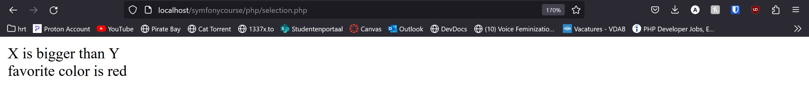
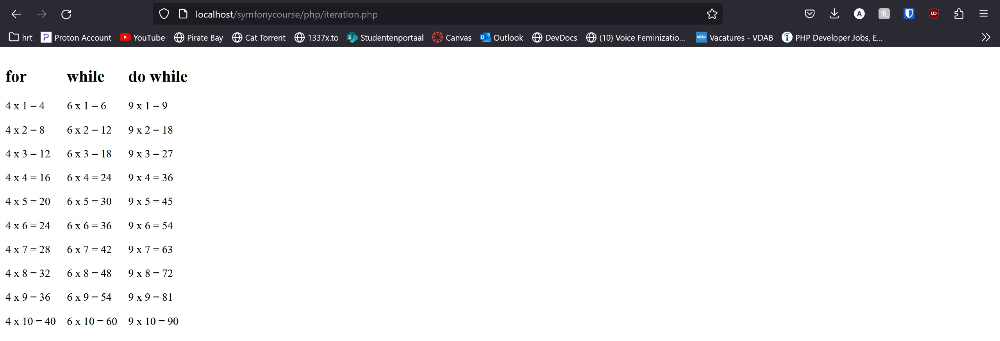

# Control structures

## Selection
In PHP, you can use the following (classical) selection structures
* `if`
* `else`
* `if elseif`
* `switch`
```php
$x = 10;
$y = 5;

if ($x > $y) {
    echo 'X is bigger than Y';
} elseif ($x < $y) {
    echo 'X is smaller than Y';
} else {
    echo 'x os equal to Y';
}

echo '<br/>';

$color = 'red';

switch ($color) {
    case 'blue':
        echo 'favorite color is blue';
        break;
    case 'green':
        echo 'favorite color is green';
        break;
    case 'red':
        echo 'favorite color is red';
        break;
}
```


## Iteration
In PHP, you can use the following (classical) iteration structures
* for
* foreach
* while
* do while (realistically no one actually uses this)
```php
<div style="display: flex">
    <div style="margin-right: 1rem;">
        <h2>for</h2>
        <?php
        $base = 4;
        for($counter = 1; $counter <= 10; $counter++) {
            echo "<p>{$base} x {$counter} = " . $counter * $base . "</p>";
        }
        ?>
    </div>
    <div style="margin-right: 1rem;">
    <h2>while</h2>
    <?php
    $base = 6;
    $counter = 1;
    while ($counter <= 10) {
        echo "<p>{$base} x {$counter} = " . $counter * $base . "</p>";
        $counter ++;
    }
    ?>
    </div>
    <div style="margin-right: 1rem;">
    <h2>do while</h2>
    <?php
    $base = 9;
    $counter = 1;
    do {
        echo "<p>{$base} x {$counter} = " . $counter * $base . "</p>";
        $counter ++;
    } while ($counter <= 10);
    ?>
    </div>
    <div>
    <h2>foreach</h2>
    <?php
    $base = 5;
    foreach(range(1, 10) as $counter) {
        echo "<p>{$base} x {$counter} = " . $counter * $base . "</p>";
    }
    ?>
    </div>
</div>
```
::: warning Remark
Normally foreach is used to loop over values in an array but for this example we loop over numbers 1 through 10 with the `range()` function
:::

